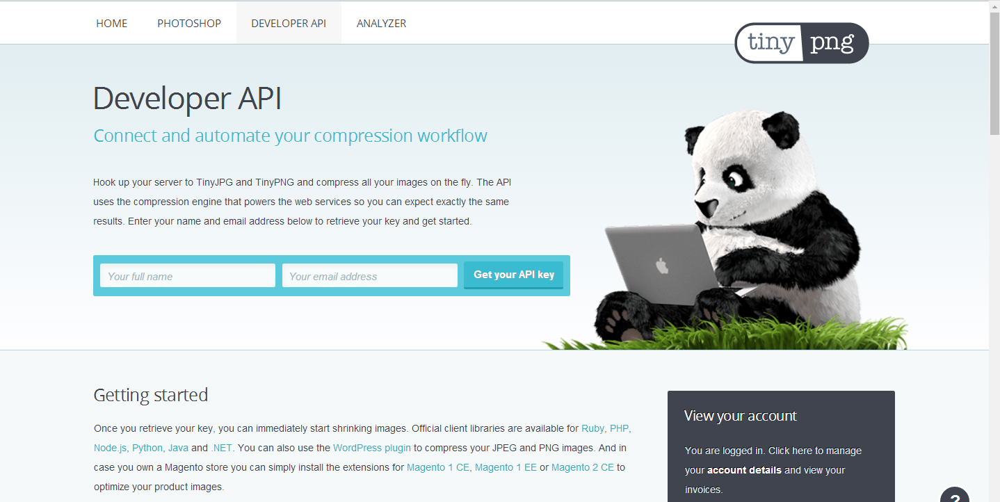
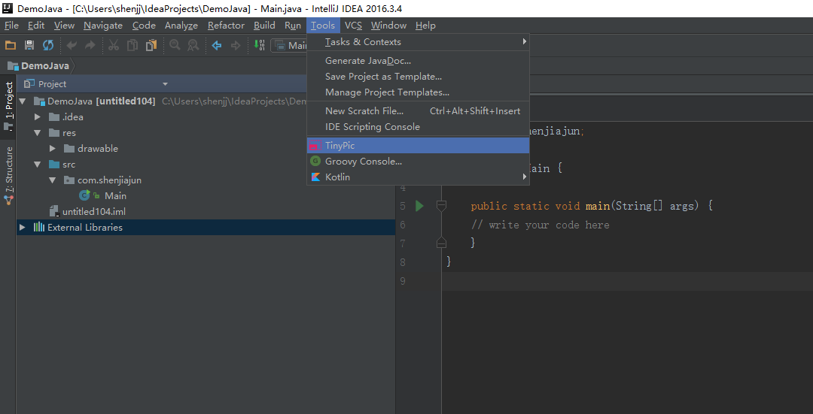
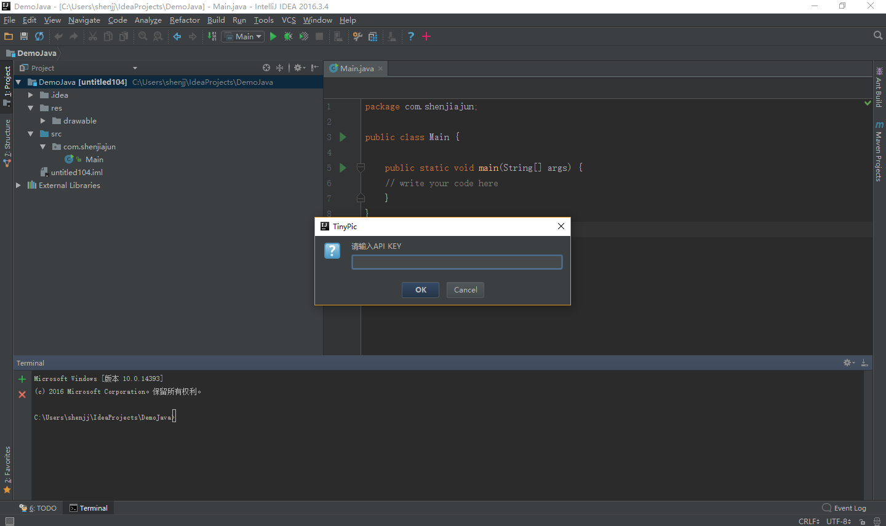
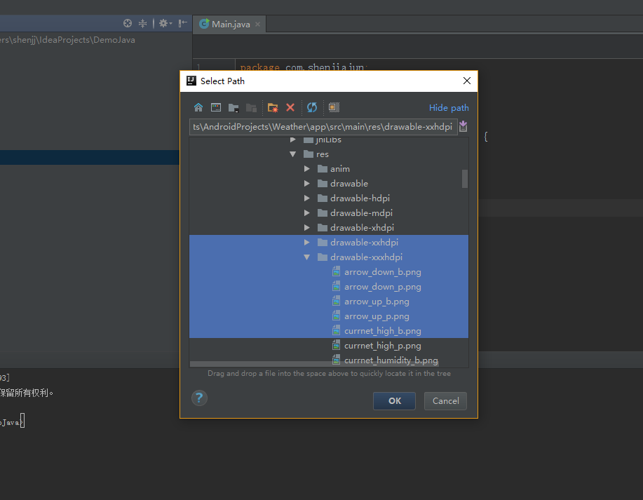
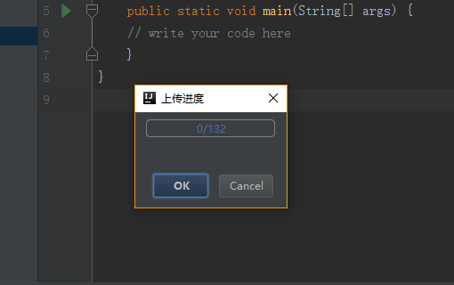
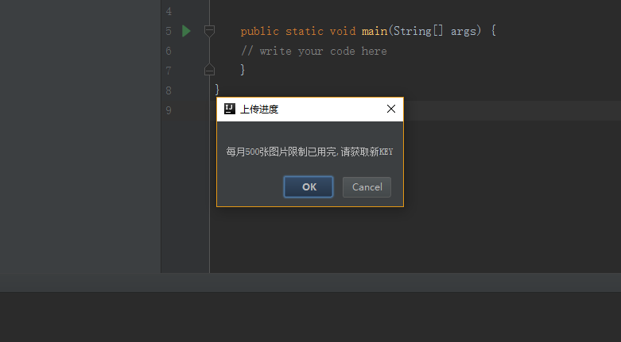

https://github.com/shenjiajun53/TinyPic 喜欢请给个star

http://www.jianshu.com/p/5f2e1b400bb8  这里是简书上的Blog，写的代码过程

# TinyPic
## 一个Intellij的插件
功能：压缩图片资源，一次最多压缩500张
压缩的核心功能是TinyPng这个网站提供的

https://tinypng.com/

但是这个网站一次只能上传20张图片，所以你需要上传下载，上传下载重复工作。
好在这个网站提供了api可以压缩图片。

在开发者页面下申请api key。对于一个key，每月有500次的免费压缩额度，如果压缩超过了
500张图片，就不能使用了。需要另外付费。但是申请这个api特别简单，填下邮箱，用户名就行，多申请
两个邮箱。1000张图片也妥妥够了。
这里推荐google个十分钟邮箱，不需要注册，只能使用十分钟，用来收一下验证码很方便

## 使用方式

1.在File->Settings->Plugins里下载插件  TinyPic

2.安装完后重启，在Tools目录下找到TinyPic

3.输入在 https://tinypng.com/developers 申请的api key

4.选择图片，可以选择图片，或者选择文件夹或者同时选中，反正是遍历文件夹下的图片，筛选jpg和png
，key的剩余次数

5.压缩进度

6.超过500次的提示（后续会考虑加入 生成压缩的信息的文件，因为大家都用git，其实也不是很必要）

